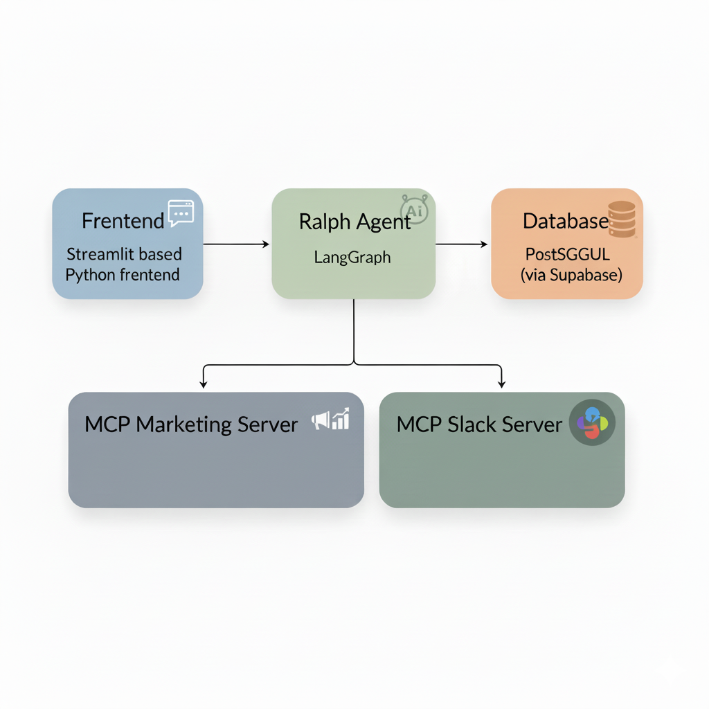
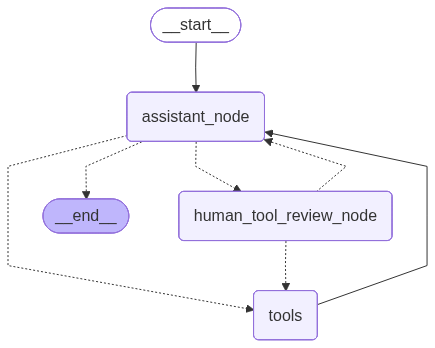

# CRM Agent AI Powered Marketing

This project demonstrates how to build an intelligent Customer Relationship Management (CRM) system using AI agents, LangGraph, and real customer data.

## 🏗️ Project Architecture



### LangGraph graph


## Core Capabilities

This system provides an intelligent approach to customer relationship management through:

- **Smart Customer Insights**: Deep analysis of purchasing patterns and customer behavior
- **Automated Email Marketing**: Generate tailored email campaigns with personalized messaging
- **Advanced Segmentation**: Implement RFM (Recency, Frequency, Monetary) methodology to classify customers into actionable groups
- **Manual Oversight Required**: All critical operations like campaign deployment require explicit human authorization
- **Live Transaction Processing**: Direct integration with your retail database
- **Multi-Strategy Campaigns**:
  - **Win-Back Initiatives**: Reconnect with dormant customer accounts
  - **Referral Programs**: Activate your most valuable customers as brand advocates
  - **Retention Efforts**: Acknowledge and reward loyal patron base

## System Requirements

Your environment needs:

- **Python 3.13 or higher**
- **PostgreSQL database** (Supabase recommended)
- **Gemini API credentials**
- **Git** version control

## Installation Guide

For the quickest deployment path, follow these steps:

This application utilizes `uv` for package management. Installation instructions for `uv` are available at [docs.astral.sh/uv/guides/install-python/](https://docs.astral.sh/uv/guides/install-python/).

### Step 1: Repository Setup

```bash
git clone
cd crm-agent
uv sync  # Installs all required packages
```

### Step 2: Environment Configuration

```bash
cp .env.example .env
# Update .env file with your Gemini credentials and database URI
```

### Step 3: Database Initialization

Create a free tier account at [supabase.com](https://supabase.com)

### Step 4: Launch Application

```bash
cd frontend && uv run python chat_local.py  # Initialize Ralph interface
```

## Usage Instructions

### Launching the Interface

Navigate to the frontend and execute:

```bash
cd frontend
uv run python chat_local.py
```

Ralph will greet you with an introduction:

```
---- 🤖 Assistant ----

Hi there! I'm Ralph, your customer service agent and marketing expert. I'm here to help you understand your customers better and create targeted marketing campaigns that drive results.

I have access to your CRM database with customer information, transaction history, and RFM analysis. I can help you:

🎯 Analyze customer behavior and segments
📧 Create personalized marketing campaigns
📊 Generate insights from your customer data
✉️ Send targeted emails to specific customer groups

What would you like to work on today?
```

### Sample Queries

Test Ralph's capabilities with these prompts:

**Analyzing Top Performers**:

```
"Display our top 5 customers ranked by total revenue"
```

**Segmentation Overview**:

```
"Provide a breakdown of customer distribution across RFM segments"
```

**Campaign Development**:

```
"Build a re-engagement strategy for customers inactive over 6 months"
```

**Email Distribution**:

```
"Draft and send appreciation emails to our champion-tier customers"
```

## Data Architecture

### RFM Segmentation Framework

The system categorizes customers using RFM scoring:

- **🏆 Champion Tier** (555): Elite customers with optimal recency, frequency, and spending metrics
- **🆕 New Active Users** (5XX): Recently engaged customer base
- **🔄 Regular Purchasers** (X5X): High-frequency transaction customers
- **💰 High-Value Accounts** (XX5): Premium spending customers
- **⚠️ Lapsed Customers** (1XX): Accounts showing purchase inactivity
- **👥 General Audience**: Remaining customer segments

### Data Base tables

Primary database tables include:

- **customers**: Profile information and communication preferences
- **transactions**: Historical purchase records
- **items**: Product inventory with specifications and pricing
- **rfm**: Segmentation scores and classifications
- **marketing_campaigns**: Campaign metadata and performance
- **campaign_emails**: Message delivery logs and engagement metrics

## Extending Functionality

Add custom tools to `src/ralph/mymcp/servers/marketing_server.py`:

```python
@mcp.tool()
async def your_custom_function(parameter: str) -> str:
    """Documentation for your custom tool."""
    # Implementation logic
    return "Function output"
```

## Technical Foundation

### Technologies Implemented

- **LangGraph**: Agent orchestration framework with state management
- **MCP (Model Context Protocol)**: Standardized AI tool communication layer
- **RFM Methodology**: Data-driven customer classification approach
- **Human-in-the-loop Design**: Supervised AI decision-making architecture
- **PostgreSQL**: Enterprise-grade relational data storage
